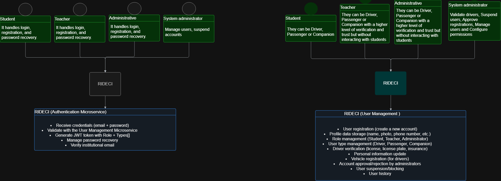
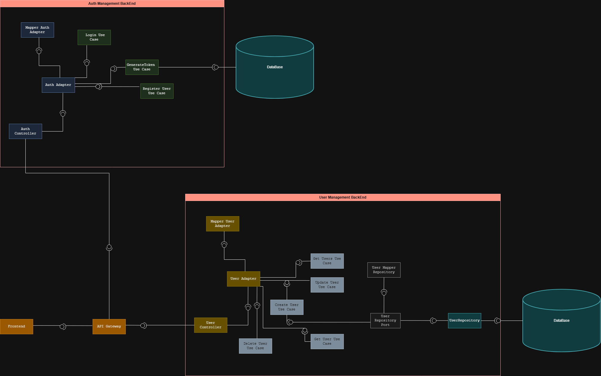
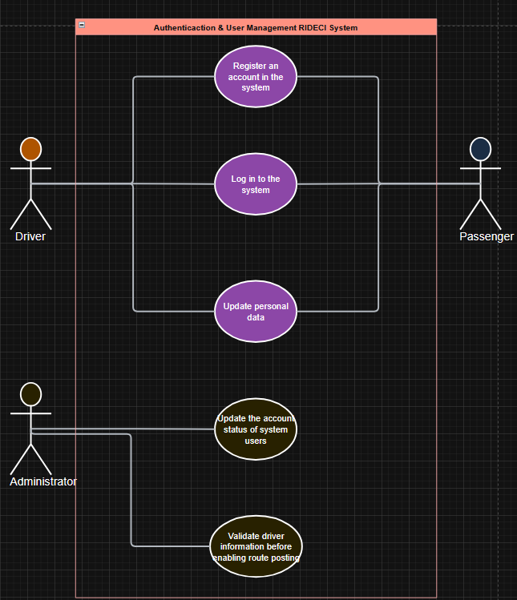
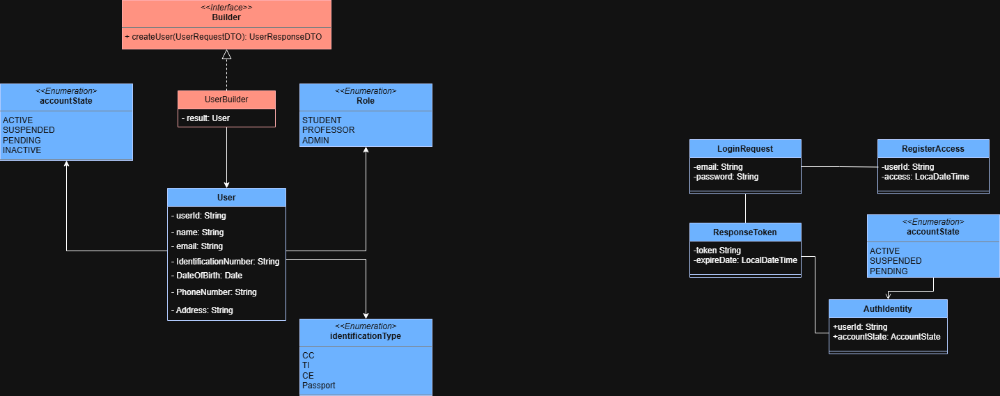
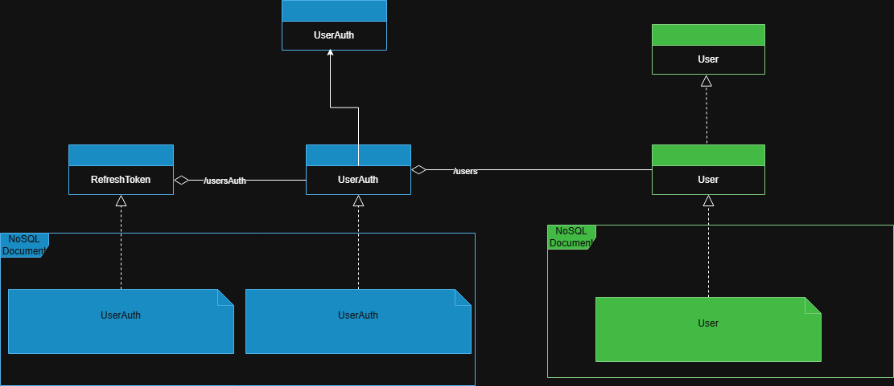
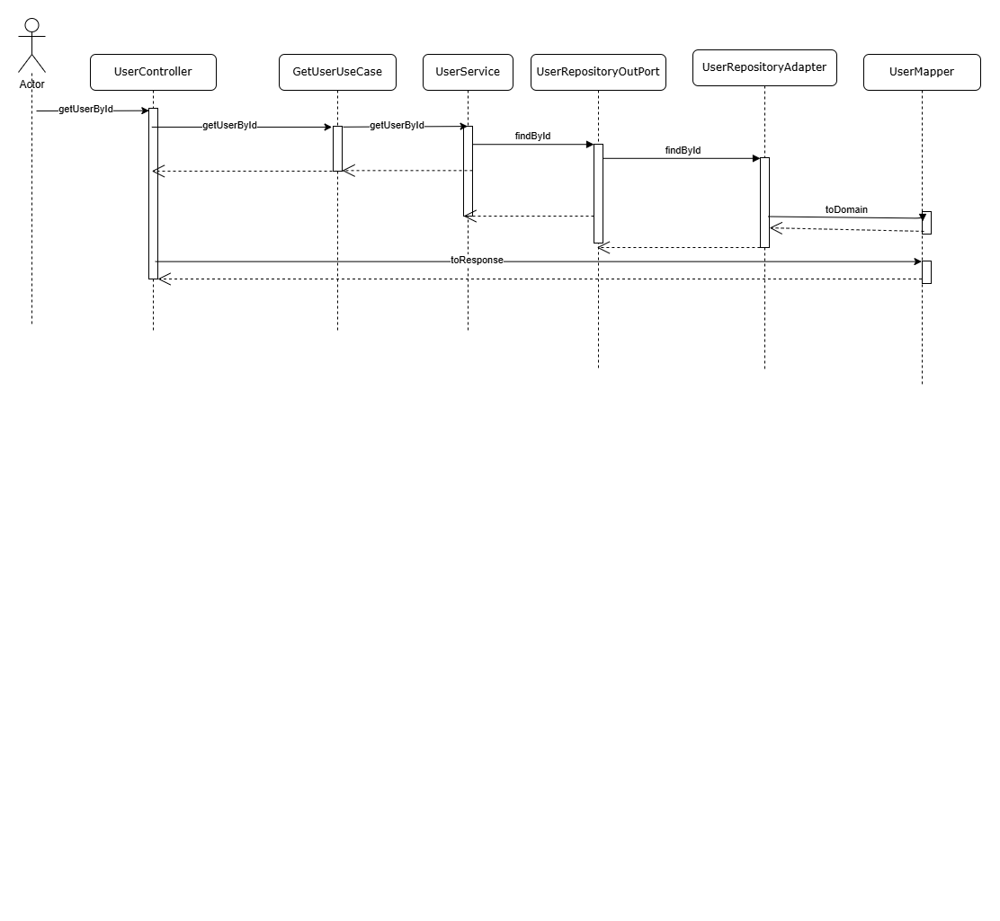
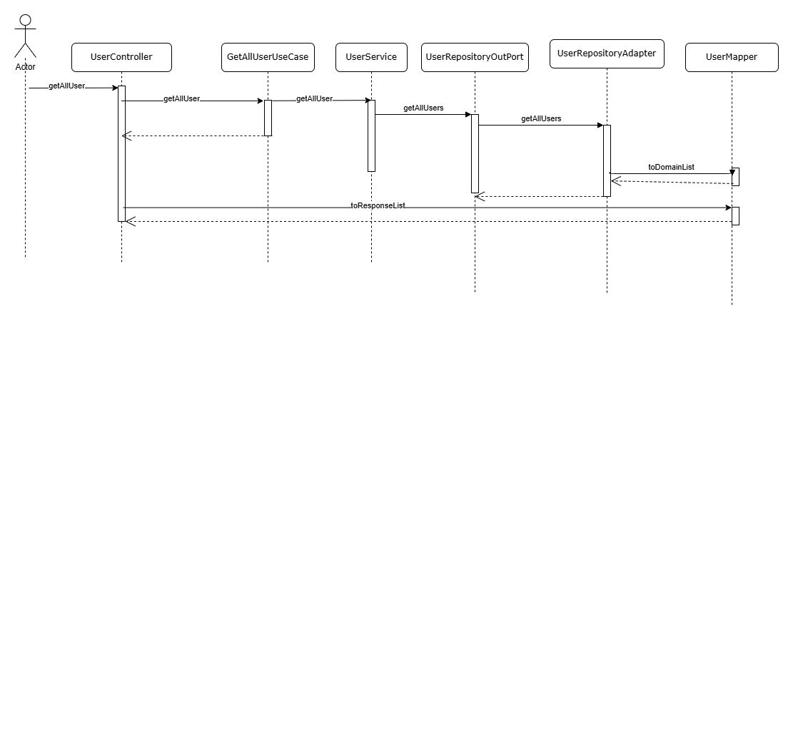
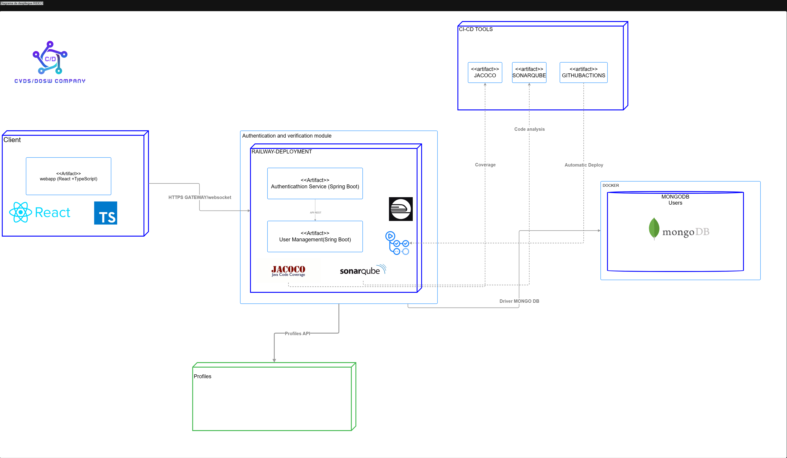
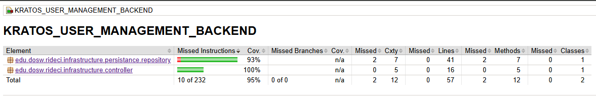
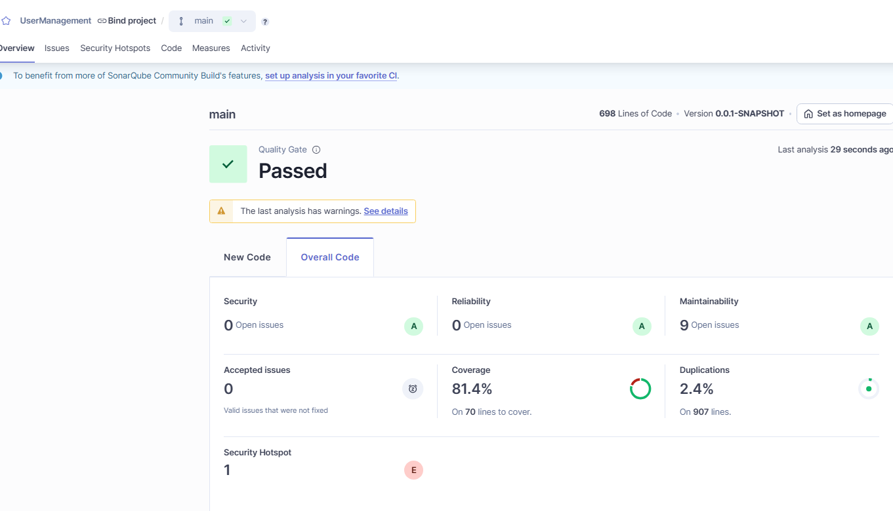

# 👥 KRATOS - User Management Backend

Microservice in charge of the **complete management of users** on the **RidECI** platform.

## 👥 Developers

* David Santiago Palacios Pinzón
* Juan Carlos Leal Cruz
* Juan Sebastian Puentes Julio
* Sebastian Albarracin Silva
* Ana Gabriela Fiquitiva Poveda

---

## 📑 Content Table

1. [Project Architecture](#-project-architecture)
    - [Hexagonal Structure](#-clean---hexagonal-structure)
2. [API Documentation](#-api-endpoints)
    - [Endpoints](#-api-endpoints)
3. [Input & Output Data](#input-and-output-data)
4. [Microservices Integration](#-connections-with-other-microservices)
5. [Technologies](#technologies)
6. [Branch Strategy](#-branches-strategy--structure)
7. [System Architecture & Design](#-system-architecture--design) 
8. [Getting Started](#-getting-started) 
9. [Testing](#-testing)

---

## 🏛️ Project Architecture

The KRATOS - User Management have a unacoplated hexagonal - clean architecture where looks for isolate the business logic with the other part of the app dividing it in multiple components:

### 🧠 DOMAIN (Core)

**Purpose:** It represents the **core of the business** and contains the most important concepts of the application. It defines **WHAT** the system does, not **HOW** it does it.

**Contains:**

- **Entities:** User.
- **Enums:** Role (STUDENT, TEACHER, ADMINISTRATOR), AccountState (ACTIVE, INACTIVE, PENDING, SUSPENDED), IdentificationType (TI, CC, PP, CE).

**Key principle:** This layer should NOT depend on external frameworks, databases or technologies.

### 🎯 APPLICATION (Aplicación)

**Purpose:** Encapsulates the **application logic** and defines the **use cases** of the system. Orchestrate how the domain is used to solve specific problems.

**Contains:**

- **Use Cases:**
  - CreateUserUseCase: Create a new user
  - UpdateUserUseCase: Update personal information
  - DeleteUserUseCase: Delete User
  - GetUserUseCase: Get user by id
  - GetAllUsersUseCase: Get all users
- **OUTs:** EventPublisher, UserRepositoryOutPort
- **LISTENERs:** UserRegisteredListener
- **Mapper:** UserMapperApplication
- **Service:** UserService

### 🏛️ INFRASTRUCTURE (Infraestructura)

**Purpose:** Implements the **technical details** that allow the system to function. It handles persistence, file storage, external communication, and configuration.

**Contains:**
- **config:** RabbitConfig Configuration
- **API/Controllers:** REST endpoints for user management.
- **DTOs:** UserRequest, UserResponse
- **Repositories:** Implementations using Spring Data MongoDB (UserRepository)
- **External Services:** RabbitEventPublisher
**Feature:** This layer DOES depend on frameworks and technologies (Spring Boot, MongoDB, Railway, etc.).


The use of this architecture has the following benefits:

* ✅ **Separation of Concerns:** Distinct boundaries between logic and infrastructure.
* ✅ **Maintainability:** Easier to update or replace specific components.
* ✅ **Scalability:** Components can evolve independently.
* ✅ **Testability:** The domain can be tested in isolation without a database or server.

## 📂 Clean - Hexagonal Structure

```
📂 kratos_user_management_backend
 ┃
 ┣ 📂 application/
 ┃  ┣ 📂 events/
 ┃  ┃  ┣ 📂 listener/
 ┃  ┃  ┣ 📄 Event
 ┃  ┣ 📂 mapper/
 ┃  ┣ 📂 port/
 ┃  ┃  ┣ 📂 in/
 ┃  ┃  ┣ 📂 out/
 ┃  ┣ 📂 service/
 ┃
 ┣ 📂 domain/
 ┃  ┣ 📂 model/
 ┃     ┣ 📂 enums/
 ┃     ┣ 📄 Modelo De Negocio
 ┃
 ┣ 📂 infrastructure/
 ┃  ┣ 📂 config/
 ┃  ┣ 📂 controller/
 ┃  ┃  ┣ 📂 dto/
 ┃  ┃   ┃  ┣ 📂 request/
 ┃  ┃   ┃  ┣ 📂 response/
 ┃  ┃   ┣ 📄 Controller
 ┃  ┃
 ┃  ┣ 📂 persistance/
 ┃     ┣ 📂 entity/
 ┃     ┣ 📂 repository/
 ┃        ┣ 📂 mapper/
 ┃
 ┗ 📄 pom.xml
```

# 📡 API Endpoints

For detailed documentation refer to our Swagger UI (Running locally at http://localhost:8080/swagger-ui.html).

Data input & output

| Method   | URI               | Description                                    | Request Body / Params                                           |
| :------- | :---------------- | :--------------------------------------------- | :-------------------------------------------------------------- |
| `POST`   | `/users`          | Creates a new user profile.                    | `{ "name": "...", "email": "...", ... }`     |
| `GET`    | `/users/{id}`     | Retrieves a user by their ID.                  | `id` (Path Variable)                                            |
| `PUT`    | `/users/{id}`     | Updates an existing user profile.              | `id` (Path Variable) + `{ "name": "...", "email": "...", ... }` |
| `DELETE` | `/users/{id}`     | Performs a logical deletion of the user.       | `id` (Path Variable)                                            |
| `GET`    | `/users/allUsers` | Returns a list of users with optional filters. |        

### 📟 HTTP Status Codes
Common status codes returned by the API.

| Code  | Status                    | Description                                           |
| :---- | :------------------------ | :---------------------------------------------------- |
| `200` | **OK**                    | Request processed successfully.                       |
| `201` | **Created**               | User created successfully.                            |
| `400` | **Bad Request**           | Invalid user data or missing parameters.              |
| `401` | **Unauthorized**          | Missing or invalid authentication token.              |
| `403` | **Forbidden**             | User does not have permission to perform this action. |
| `404` | **Not Found**             | User ID not found.                                    |
| `409` | **Conflict**              | Email already exists or conflicting user data.        |
| `500` | **Internal Server Error** | Unexpected server-side error.                         |

# 🔗 Connections with other Microservices

This module does not work alone. It interacts with the RideCi Ecosystem via REST APIs and Message Brokers (RabbitMQ):

1. Authentication Microservice: Responsible for receiving user data and constructing the UserDocument.
2. Profiles Microservice: The Profiles Microservice depends on user-related data provided by other services.
Specifically, it requires only the User ID and User Name in order to build and maintain user profile information.
It does not handle authentication data directly; instead, it focuses exclusively on profile attributes and associations.

# Technologies

The following technologies were used to build and deploy this module:

### Backend & Core


### Database


### DevOps & Infrastructure


### CI/CD & Quality Assurance


### Documentation & Testing


### Design 


### Comunication & Project Management


---

# 🌿 Branches Strategy & Structure

This module follows a strict branching strategy based on Gitflow to ensure the ordered versioning,code quality and continous integration.


| **Branch**                | **Purpose**                            | **Receive of**           | **Sent to**        | **Notes**                      |
| ----------------------- | ---------------------------------------- | ----------------------- | ------------------ | ------------------------------ |
| `main`                  | 🏁 Stable code for preproduction or Production | `release/*`, `hotfix/*` | 🚀 Production      | 🔐 Protected with PR y successful CI   |
| `develop`               | 🧪 Main developing branch             | `feature/*`             | `release/*`        | 🔄 Base to continous deployment |
| `feature/*`             | ✨ New functions or refactors  to be implemented       | `develop`               | `develop`          | 🧹 Are deleted after merge to develop      |
| `release/*`             | 📦 Release preparation & final polish.      | `develop`               | `main` and `develop` | 🧪  Includes final QA. No new features added here.     |
| `bugfix/*` or `hotfix/*` | 🛠️ Critical fixes for production         | `main`                  | `main` and `develop` | ⚡ Urgent patches. Highest priority

# 🏷️ Naming Conventions

## 🌿 Branch Naming

### ✨ Feature Branches
Used for new features or non-critical improvements.

**Format:**
`feature/[shortDescription]`

**Examples:**
- `feature/authenticationModule`
- `feature/securityService`

**Rules:**
* 🧩 **Case:** strictly *camelCase* (lowercase with hyphens).
* ✍️ **Descriptive:** Short and meaningful description.

## 🔥 Commit Conventions

### 🚀 Standard Format

```
[type]: [short description of the action]
```

**Ejemplos:**

```
feat: implement driver document verification
fix: correct reputation average calculation
```

---

### 🏷️ Commit Types

| **Type**   | **Description**                        | **Example**                               |
| ---------- | -------------------------------------- | ----------------------------------------- |
| `feat`     | New functionality                      | `feat: add vehicle registration endpoint` |
| `fix`      | Bug fixes                              | `fix: fix issue in profile update`        |
| `docs`     | Documentation changes                  | `docs: update API documentation`          |
| `refactor` | Refactoring without functional changes | `refactor: optimize user query`           |
| `test`     | Unit or integration tests              | `test: add tests for reputation service`  |
| `chore`    | Maintenance or configuration           | `chore: update Spring dependencies`       |


**Rules**

* One commit = one complete action
* Use the imperative mood (“add”, “fix”, “update”, etc.)
* Provide a clear description of what and where
* Keep commits small and frequent

# 📐 System Architecture & Design

This section provides a visual representation of the module's architecture ilustrating the base diagrams to show the application structure and components flow.

### 🧩 Context Diagram
---
Text



### 🧩 Specific Components Diagram
---
This diagram illustrates the structure and dependencies between components in the User Management and Authentication microservices.
Both services apply Hexagonal Architecture (Ports & Adapters), ensuring separation of concerns, maintainability, and independent testability.

*Authentication*:

This module handles user authentication and token generation. It is organized into controllers, adapters, use cases, and outbound ports.

* Controllers:
    * Auth Controller
      Receives and processes all HTTP requests related to login and registration.
      It converts these inputs into internal DTOs and forwards them to the adapters.

When applying a hexagonal architecture, before developing the use cases, we need adapter components:

* Use Cases:

    * Login Use Case:
      Validates credentials and triggers token generation.

    * Register User Use Case:
      Registers a new user in the system through the outbound port.

    * Generate Token Use Case:
      Issues security tokens (e.g., JWT) after a successful authentication.

* Ports:

    * Database Port:
      Allows the use cases to persist or retrieve authentication-related data.

*User Management*:

This service handles user lifecycle (create, update, delete, retrieve) following strict hexagonal architecture separation.

* Controllers:

  * User Controller:
    Central entry point for all user-related API requests.
    It delegates the execution to the User Adapter and relies on DTOs for communication.

* Use Cases:

  These represent application-specific business rules:

   * Create User Use Case:
    Handles registration logic within the User Management context.

   * Update User Use Case:
    Manages modifications to user profiles.

   * Delete User Use Case:
    Performs logical deletion of a user.

   * Get User Use Case:
    Retrieves user information by ID.

   * Get Users Use Case:
    Provides user listing with optional filters.

* Ports

  Ports define what the application expects from its infrastructure:

  * User Repository Port:
    Interface that declares what operations the domain needs from the persistence layer.




### 🧩 Use Cases Diagram
---
This diagram presents the main functionalities defined by each actor. This facilitates a better understanding when implementing the module's multiple functions, as well as identifying and separating each actor's roles when using the application.



### 🧩 Class Diagram
---
Based on the Specific Components diagram, we created the class diagram, where we defined an Builder design pattern that will help to create users in the system.



### 🧩 Data Base Diagram
---

This diagram represents how the data is stored, where we will find the multiple documents, and the data that will be stored in an embedded or referenced manner.




### 🧩 Sequence Diagrams
---
.png)
.png)
.png)




### 🧩 Specific Deploy Diagram
---
This diagram illustrates the cloud deployment architecture and workflow of the Authentication and User Management module.


# 🧪 Testing

Testing is a essential part of the project functionability, this part will show the code coverage and code quality analazing with tools like JaCoCo and SonarQube.

### 📊 Code Coverage (JaCoCo)
---



### 🔍 Static Analysis (SonarQube)


# 🚀 Getting Started

This section guides you through setting ip the project locally. This project requires **Java 17**. If you have a different version, you can change it or we recommend using **Docker** to ensure compatibility before compile.

### Clone & open repository

``` bash
git clone https://github.com/RIDECI/KRATOS_USER-MANAGEMENT_BACKEND.git
```

``` bash
cd KRATOS_USER-MANAGEMENT_BACKEND
```

You can open it on your favorite IDE

### Dockerize the project

Dockerize before compile the project avoid configuration issues and ensure environment consistency.

``` bash
docker compose up -d
```

### Install dependencies & compile project

Download dependencies and compile the source code.

``` bash
mvn clean install
```

``` bash
mvn clean compile
```

### To run the project
Start the Spring Boot server

``` bash
mvn spring-boot:run
```

